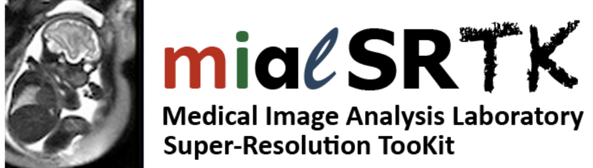

MIAL Super-Resolution Toolkit
************************************

**Latest released version:** |release|

This neuroimaging processing pipeline software is developed by the Medical Image Analysis Laboratory (MIAL) at the University Hospital of Lausanne (CHUV) for use within the lab, as well as for open-source software distribution.

.. image:: https://img.shields.io/github/v/release/Medical-Image-Analysis-Laboratory/mialsuperresolutiontoolkit?include_prereleases   
  :alt: GitHub release (latest by date including pre-releases)
.. image:: https://zenodo.org/badge/DOI/10.5281/zenodo.4290209.svg
  :target: https://doi.org/10.5281/zenodo.4290209
  :alt: Digital Object Identifier
.. image:: https://img.shields.io/docker/pulls/sebastientourbier/mialsuperresolutiontoolkit?label=docker%20pulls
  :target: https://hub.docker.com/repository/docker/sebastientourbier/mialsuperresolutiontoolkit
  :alt: Docker Pulls
.. image:: https://travis-ci.com/Medical-Image-Analysis-Laboratory/mialsuperresolutiontoolkit.svg?branch=master
  :target: https://travis-ci.com/Medical-Image-Analysis-Laboratory/mialsuperresolutiontoolkit
  :alt: TravisCI Status (C++)
.. image:: https://circleci.com/gh/Medical-Image-Analysis-Laboratory/mialsuperresolutiontoolkit.svg?style=shield
  :target: https://app.circleci.com/pipelines/github/Medical-Image-Analysis-Laboratory/mialsuperresolutiontoolkit
  :alt: CircleCI Status (BIDS-App)
.. image:: https://app.codacy.com/project/badge/Coverage/a27593d6fae7436eb2cd65b80f3342c3
  :target: https://www.codacy.com/gh/Medical-Image-Analysis-Laboratory/mialsuperresolutiontoolkit?utm_source=github.com&amp;utm_medium=referral&amp;utm_content=Medical-Image-Analysis-Laboratory/mialsuperresolutiontoolkit&amp;utm_campaign=Badge_Coverage
  :alt: Code Coverage
.. image:: https://readthedocs.org/projects/mialsrtk/badge/?version=latest
  :target: https://mialsrtk.readthedocs.io/en/latest/?badge=latest
  :alt: Documentation Status
.. image:: https://app.codacy.com/project/badge/Grade/a27593d6fae7436eb2cd65b80f3342c3    
  :target: https://www.codacy.com/gh/Medical-Image-Analysis-Laboratory/mialsuperresolutiontoolkit?utm_source=github.com&amp;utm_medium=referral&amp;utm_content=Medical-Image-Analysis-Laboratory/mialsuperresolutiontoolkit&amp;utm_campaign=Badge_Grade
  :alt: Code Quality
.. image:: https://img.shields.io/github/all-contributors/Medical-Image-Analysis-Laboratory/mialsuperresolutiontoolkit
  :target:
  :alt: Github All Contributors  

.. warning:: THIS SOFTWARE IS FOR RESEARCH PURPOSES ONLY AND SHALL NOT BE USED FOR ANY CLINICAL USE. THIS SOFTWARE HAS NOT BEEN REVIEWED OR APPROVED BY THE FOOD AND DRUG ADMINISTRATION OR EQUIVALENT AUTHORITY, AND IS FOR NON-CLINICAL, IRB-APPROVED RESEARCH USE ONLY. IN NO EVENT SHALL DATA OR IMAGES GENERATED THROUGH THE USE OF THE SOFTWARE BE USED IN THE PROVISION OF PATIENT CARE.

Introduction
=============

The `Medical Image Analysis Laboratory Super-Resolution ToolKit (MIALSRTK)` consists of a set of C++ and Python3 image processing and worflow tools necessary to perform motion-robust super-resolution fetal MRI reconstruction. 

The *original* `C++ MIALSRTK` library includes all algorithms and methods for brain extraction, intensity standardization, motion estimation and super-resolution. It uses the CMake build system and depends on the open-source image processing Insight ToolKit (ITK) library, the command line parser TCLAP library and OpenMP for multi-threading. 

`MIALSRTK` has been extended with the `pymialsrtk` Python3 library following recent advances in standardization of neuroimaging data organization and processing workflows (See :ref:`BIDS and BIDS App standards <cmpbids>`). This library has a modular architecture built on top of the Nipype dataflow library which consists of (1) processing nodes that interface with each of the MIALSRTK C++ tools and (2) a processing pipeline that links the interfaces in a common workflow. 

The processing pipeline with all dependencies including the C++ MIALSRTK tools are encapsulated in a Docker image container, which is now distributed as a `BIDS App` which handles datasets organized following the BIDS standard. See :ref:`BIDS App usage <cmdusage>` for more details.

All these design considerations allow us not only to (1) represent the entire processing pipeline as an *execution graph, where each MIALSRTK C++ tools are connected*, but also to (2) provide a *mecanism to record data provenance and execution details*, and to (3) easily customize the BIDS App to suit specific needs as interfaces with *new tools can be added with relatively little effort* to account for additional algorithms. 

Aknowledgment
--------------

If your are using `MIALSRTK` in your work, please acknowledge this software and its dependencies. See :ref:`Citing <citing>` for more details.

License information
--------------------

This software is distributed under the open-source license Modified BSD. See :ref:`license <LICENSE>` for more details.

All trademarks referenced herein are property of their respective holders.

Help/Questions
---------------

If you run into any problems or have any code bugs or questions, please create a new `GitHub Issue <https://github.com/Medical-Image-Analysis-Laboratory/mialsuperresolutiontoolkit/issues>`_.

Eager to contribute?
---------------------

See :ref:`Contributing <contributing>` for more details.

Funding
--------

Originally supported by the Swiss National Science Foundation (grant SNSF-141283).

Contents
=========

.. _getting_started:

.. toctree::
   :maxdepth: 2
   :caption: Getting started

   installation

.. _user-docs:

.. toctree::
   :maxdepth: 2
   :caption: User Documentation

   bids
   usage
   outputs

.. _api-doc:

.. toctree::
   :maxdepth: 5
   :caption: API Documentation

   api_commandlineinterface
   api_preprocess
   api_postprocess
   api_reconstruction
   api_utils
   api_pipelines

.. _user-usecases:

.. toctree::
   :maxdepth: 1
   :caption: Examples & Tutorials
   
.. NLM denoising <notebooks/brainHack.ipynb>

.. _about-docs:

.. toctree::
   :maxdepth: 1
   :caption: About MIALSRTK

   LICENSE
   citing
   changes
   contributing
   contributors
