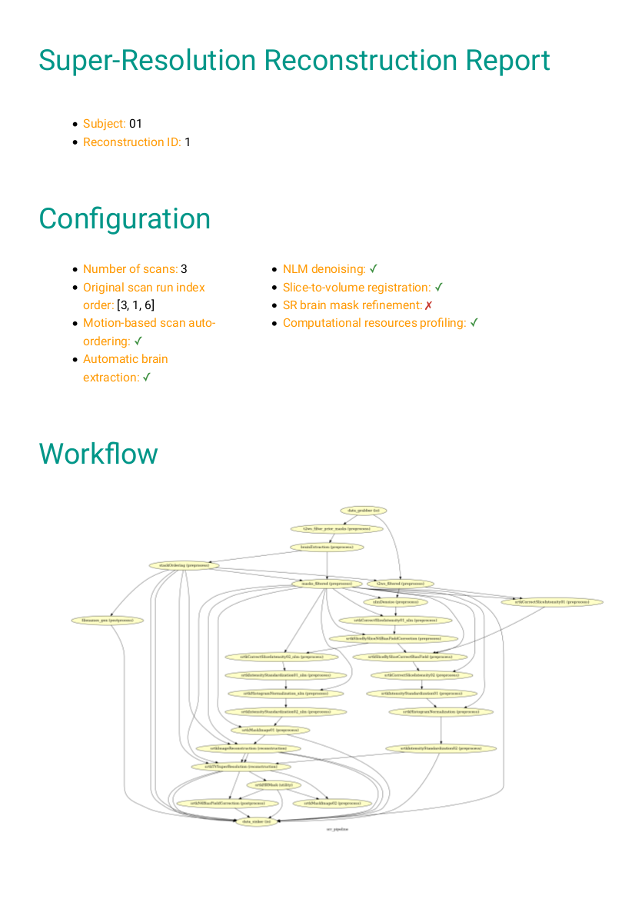
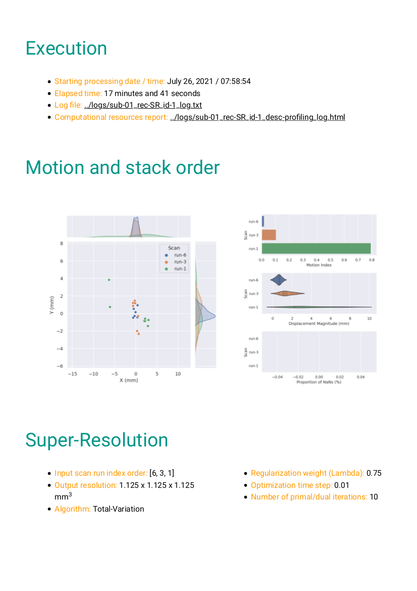
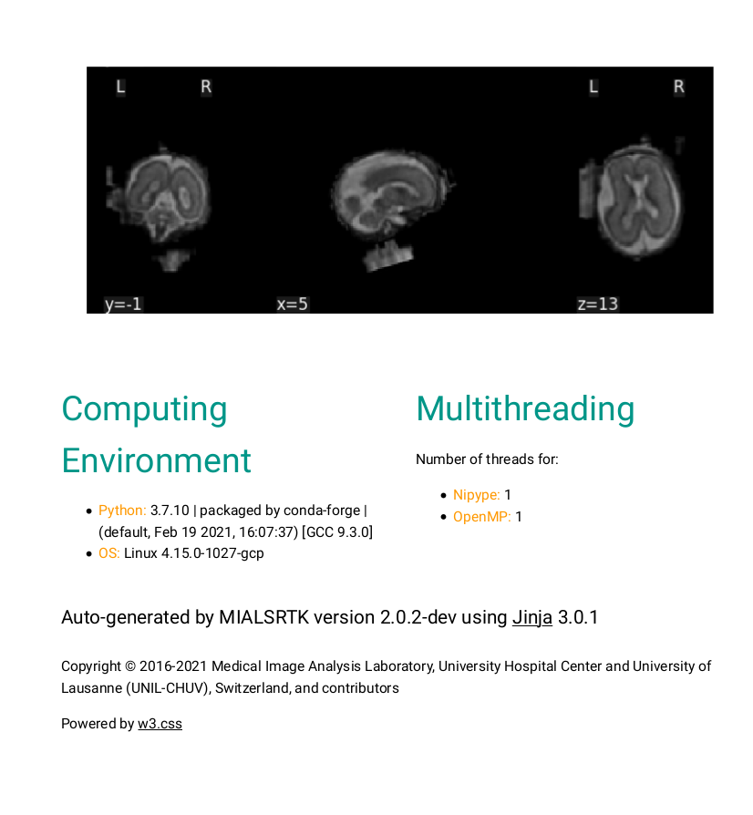
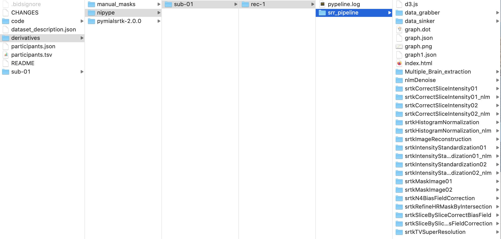
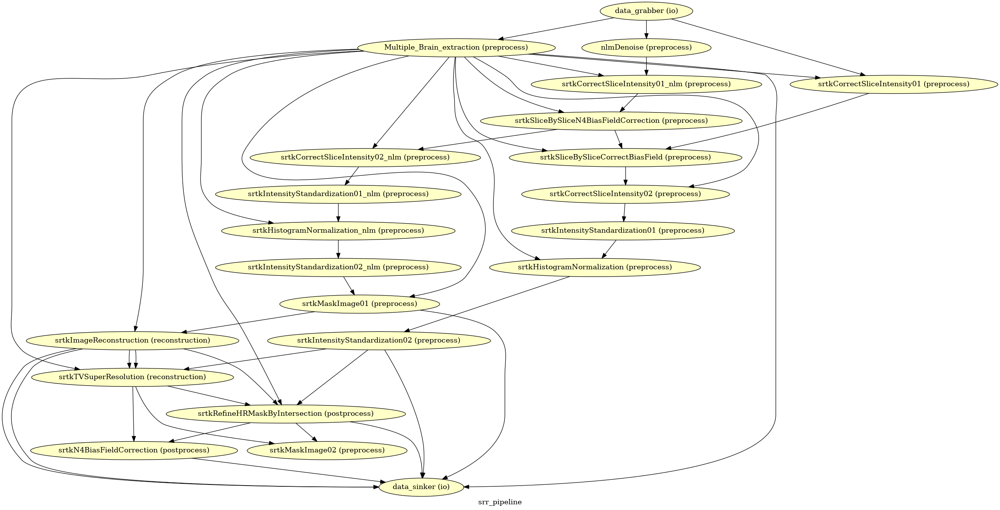
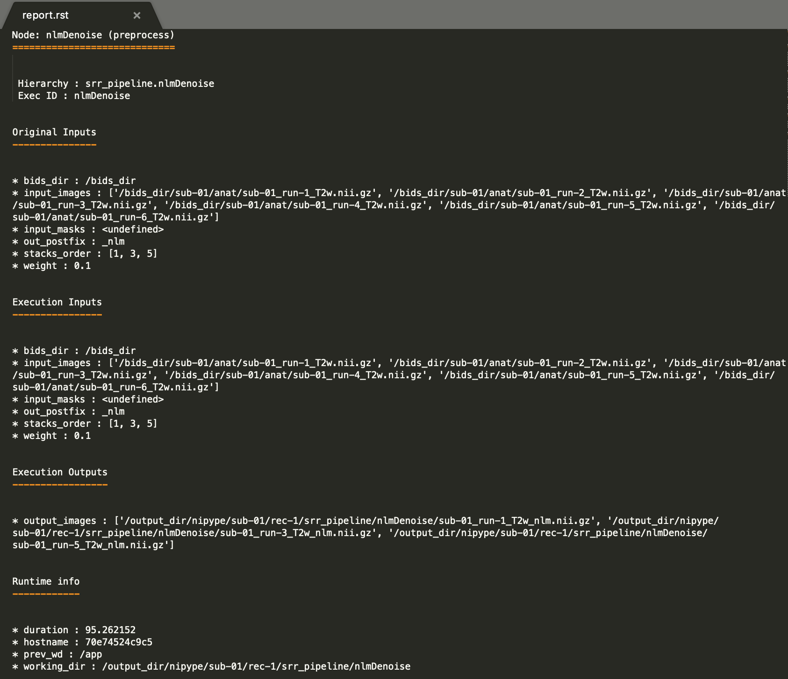

*****************************************
Outputs of MIALSRTK BIDS App
*****************************************

Processed, or derivative, data are outputed to ``<bids_dataset/derivatives>/`` and follow the :abbr:`BIDS (Brain Imaging Data Structure)` v1.4.1 standard (see `BIDS Derivatives <https://bids-specification.readthedocs.io/en/v1.4.1/05-derivatives/01-introduction.html>`_) whenever possible.  

BIDS derivatives entities
--------------------------

.. tabularcolumns:: |l|p{5cm}|

+--------------------------+------------------------------------------------------------------------------------------------------------+
| **Entity**               | **Description**                                                                                            |
+==========================+============================================================================================================+
| ``sub-<label>``          | Distinguish different subjects                                                                             |
+--------------------------+------------------------------------------------------------------------------------------------------------+
| ``ses-<label>``          | Distinguish different T2w scan acquisition sessions                                                        |
+--------------------------+------------------------------------------------------------------------------------------------------------+
| ``run-<label>``          | Distinguish different T2w scans                                                                            |
+--------------------------+------------------------------------------------------------------------------------------------------------+
| ``rec-<label>``          | Distinguish images reconstructed using scattered data interpolation (SDI) or super-resolution (SR) methods |
+--------------------------+------------------------------------------------------------------------------------------------------------+
| ``id-<label>``           | Distinguish outputs of reconstructions run multiple times with different configuration                     |
+--------------------------+------------------------------------------------------------------------------------------------------------+

See `Original BIDS Entities Appendix <https://bids-specification.readthedocs.io/en/v1.4.1/99-appendices/09-entities.html>`_ for more description.

.. note:: A new entity `id-<label>` has been introduced to distinguish between outputs when the pipeline is run with multiple configurations (such a new order of scans) on the same subject.

Main MIALSRTK BIDS App Derivatives
==========================================

Main outputs produced by MIALSRTK BIDS App are written to ``<bids_dataset/derivatives>/pymialsrtk-<variant>/sub-<label>/(_ses-<label>/)``. The execution log of the full workflow is saved as `sub-<label>(_ses-<label>)_id-<label>_log.txt``.

Anatomical derivatives
------------------------
* Anatomical derivatives are placed in each subject's ``anat/`` subfolder, including:

    * The brain masks of the T2w scans:

        - ``anat/sub-<label>(_ses-<label>)_run-01_id-<label>_desc-brain_mask.nii.gz``
        - ``anat/sub-<label>(_ses-<label>)_run-02_id-<label>_desc-brain_mask.nii.gz``
        - ``anat/sub-<label>(_ses-<label>)_run-03_id-<label>_desc-brain_mask.nii.gz``
        - ...

    * The preprocessed T2w scans used for slice motion estimation and scattered data interpolation (SDI) reconstruction:

        - ``anat/sub-<label>(_ses-<label>)_run-01_id-<label>_desc-preprocSDI_T2w.nii.gz``
        - ``anat/sub-<label>(_ses-<label>)_run-02_id-<label>_desc-preprocSDI_T2w.nii.gz``
        - ``anat/sub-<label>(_ses-<label>)_run-03_id-<label>_desc-preprocSDI_T2w.nii.gz``
        - ...
        
    * The preprocessed T2w scans used for super-resolution reconstruction:

        - ``anat/sub-<label>(_ses-<label>)_run-01_id-<label>_desc-preprocSR_T2w.nii.gz``
        - ``anat/sub-<label>(_ses-<label>)_run-02_id-<label>_desc-preprocSR_T2w.nii.gz``
        - ``anat/sub-<label>(_ses-<label>)_run-03_id-<label>_desc-preprocSR_T2w.nii.gz``
        - ...
   
    * The high-resolution image reconstructed by SDI:

        - ``anat/sub-<label>(_ses-<label>)_rec-SDI_id-<label>_T2w.nii.gz``
        - ``anat/sub-<label>(_ses-<label>)_rec-SDI_id-<label>_T2w.json``

    * The high-resolution image reconstructed by SDI:

        - ``anat/sub-<label>(_ses-<label>)_rec-SR_id-<label>_T2w.nii.gz``
        - ``anat/sub-<label>(_ses-<label>)_rec-SR_id-<label>_T2w.json``

* The slice-by-slice transforms of all T2W scans estimated during slice motion estimation and SDI reconstruction and used in the super-resolution forward model are placed in each subject's ``xfm/`` subfolder:

    - ``xfm/sub-<label>(_ses-<label>)_run-1_id-<label>_T2w_from-origin_to-SDI_mode-image_xfm.txt``
    - ``xfm/sub-<label>(_ses-<label>)_run-2_id-<label>_T2w_from-origin_to-SDI_mode-image_xfm.txt``
    - ``xfm/sub-<label>(_ses-<label>)_run-3_id-<label>_T2w_from-origin_to-SDI_mode-image_xfm.txt``
    - ...

* The HTML processing report which provides in one place: pipeline/workflow configuration summary, Nipype workflow execution graph, links to the log and the profiling output report, plots for the quality check of the automatic reordering step based on the motion index, three orthogonal cuts of the reconstructed image, and computing environment summary. It is placed in each subject's ``report/`` subfolder:

    - ``report/sub-<label>.html``

* The Nipype execution and the profiling log files can be found in each subject's ``logs/`` subfolder as:

    - ``logs/sub-01_rec-SR_id-1_log.txt``
    - ``logs/sub-01_rec-SR_id-1_desc-profiling_log.html``

* The PNG images generated by the stack auto-reordering and the super-resolution nodes can be found in each subject's ``figures/`` subfolder as:

    - ``figures/sub-01_rec-SR_id-1_desc-motion_stats.png``
    - ``figures/sub-01_rec-SR_id-1_desc-processing_graph.png``

Nipype Workflow Derivatives
==========================================

The execution of the Nipype workflow (pipeline) involves the creation of a number of intermediate outputs for each subject `sub-<label>` and each run `rec-<id_label>` which are written to ``<bids_dataset/derivatives>/nipype/sub-<label>/rec-<id_label>/srr_pipeline`` where `<id_label>` corresponds to the label used previously for the entity `id-<label>`: 

To enhance transparency on how data is processed, outputs include a pipeline execution graph saved as ``srr_pipeline/graph.png`` which summarizes all processing nodes involves in the given processing pipeline:

Execution details (data provenance) of each interface (node) of a given pipeline are reported in ``srr_pipeline/<interface_name>/_report/report.rst``

`MIALSRTK` can monitor the computational resources used by each interface / node of the workflow,
if run `--profiling` option flag. It will generate ``srr_pipeline/run_stats.log.html`` which reports
run times, number of executed threads, and amount of used memory in the form of a HTML gantt chart.

.. raw:: html

    <iframe src="_static/run_stats.log.html" height="345px" width="100%"></iframe>