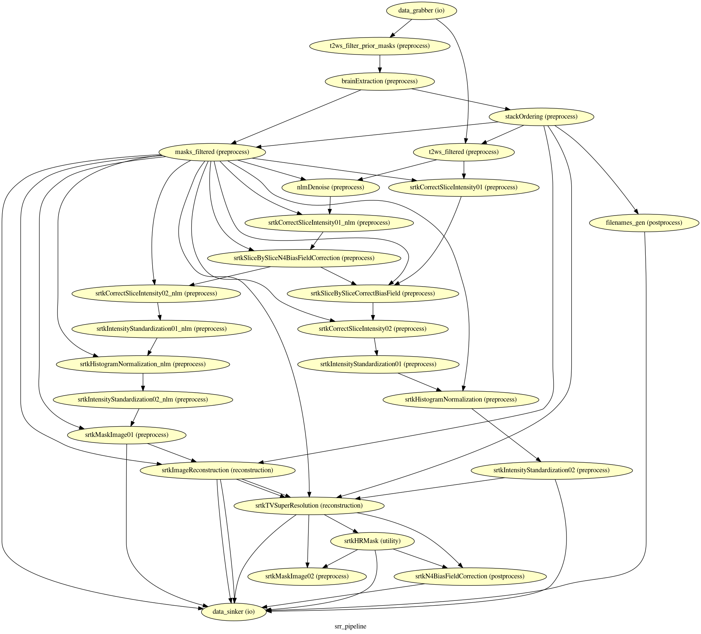

*****************************************
Outputs of MIALSRTK BIDS App
*****************************************

Processed, or derivative, data are outputed to ``<bids_dataset/derivatives>/``. 

Main MIALSRTK BIDS App Derivatives
==========================================

Main outputs produced by MIALSRTK BIDS App are written to ``<bids_dataset/derivatives>/pymialsrtk-<variant>/sub-<subject_label>/``. An execution log of the full workflow is saved as `sub-<subject_label>_log.txt``

Anatomical derivatives
------------------------
* Anatomical derivatives are placed in each subject's ``anat/`` subfolder, including:

  * The brain masks of the T2w scans:

        - ``anat/sub-<subject_label>_run-01_desc-brain_mask.nii.gz``
        - ``anat/sub-<subject_label>_run-02_desc-brain_mask.nii.gz``
        - ``anat/sub-<subject_label>_run-03_desc-brain_mask.nii.gz``
        - ...

    * The preprocessed T2w scans used for slice motion estimation and scattered data interpolation (SDI) reconstruction:

        - ``anat/sub-<subject_label>_run-01_desc-SDIprep_T2w.nii.gz``
        - ``anat/sub-<subject_label>_run-02_desc-SDIprep_T2w.nii.gz``
        - ``anat/sub-<subject_label>_run-03_desc-SDIprep_T2w.nii.gz``
        - ...
        
    * The preprocessed T2w scans used for super-resolution reconstruction:

        - ``anat/sub-<subject_label>_run-01_desc-SRprep_T2w.nii.gz``
        - ``anat/sub-<subject_label>_run-02_desc-SRprep_T2w.nii.gz``
        - ``anat/sub-<subject_label>_run-03_desc-SRprep_T2w.nii.gz``
        - ...
       
        
    * The high-resolution image reconstructed by SDI:

        - ``anat/sub-01_rec-SDI_id-1_T2w.nii.gz``
        - ``anat/sub-01_rec-SDI_id-1_T2w.json``
        
    * The high-resolution image reconstructed by SDI:

        - ``anat/sub-01_rec-SR_id-1_T2w.nii.gz``
        - ``anat/sub-01_rec-SR_id-1_T2w.json``

Nipype Workflow Derivatives
==========================================

The execution of the Nipype workflow (pipeline) involves the creation of a number of intermediate outputs which are written to ``<bids_dataset/derivatives>/nipype/sub-<subject_label>/anatomical_pipeline``: 

.. image:: images/nipype_wf_derivatives.png
    :width: 888
    :align: center

To enhance transparency on how data is processed, outputs include a pipeline execution graph saved as ``anatomical_pipeline/graph.svg`` which summarizes all processing nodes involves in the given processing pipeline:

Execution details (data provenance) of each interface (node) of a given pipeline are reported in ``anatomical_pipeline/<interface_name>/_report/report.rst``

.. image:: images/nipype_node_report.png
    :width: 888
    :align: center

.. note:: MIALSRTK BIDS App outputs are currently being updated to conform to the :abbr:`BIDS (brain imaging data structure)` Derivatives specification (see `BIDS Derivatives Extension <https://bids-specification.readthedocs.io/en/v1.4.0/>`_). 
